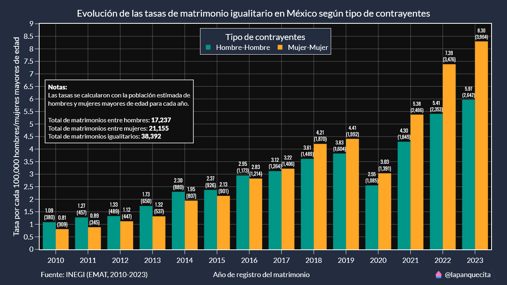
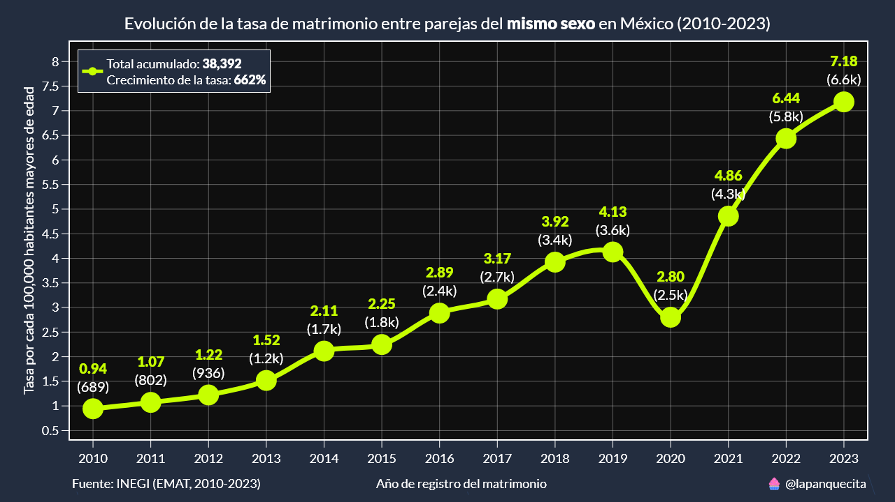
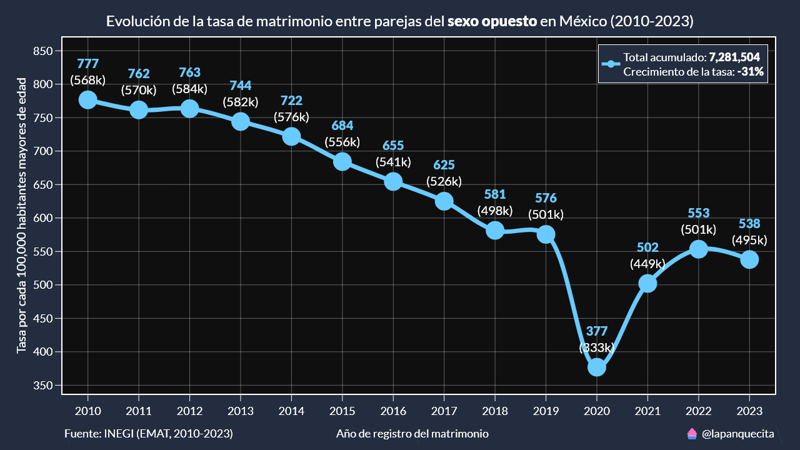
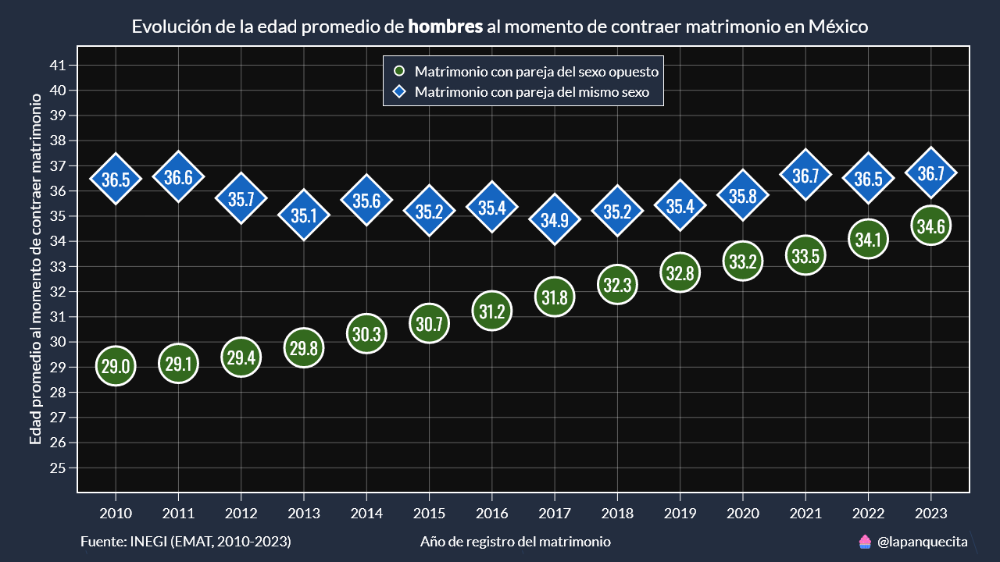
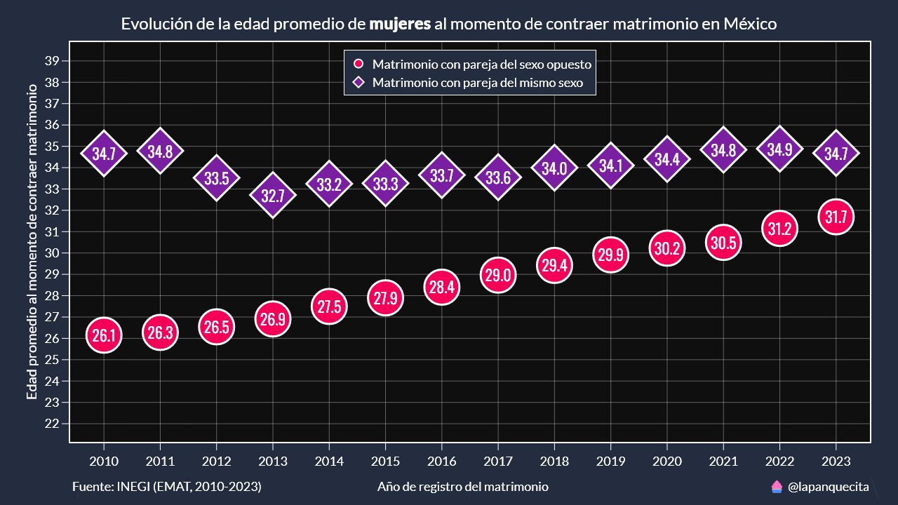
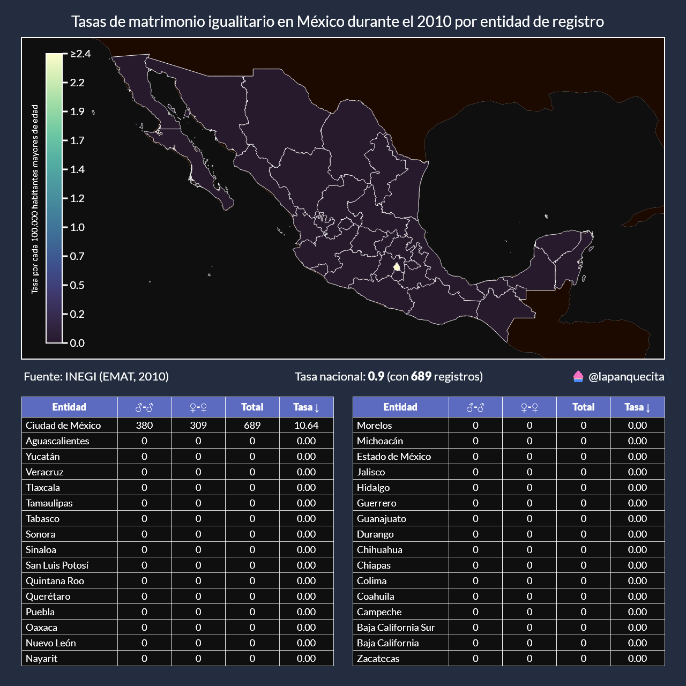
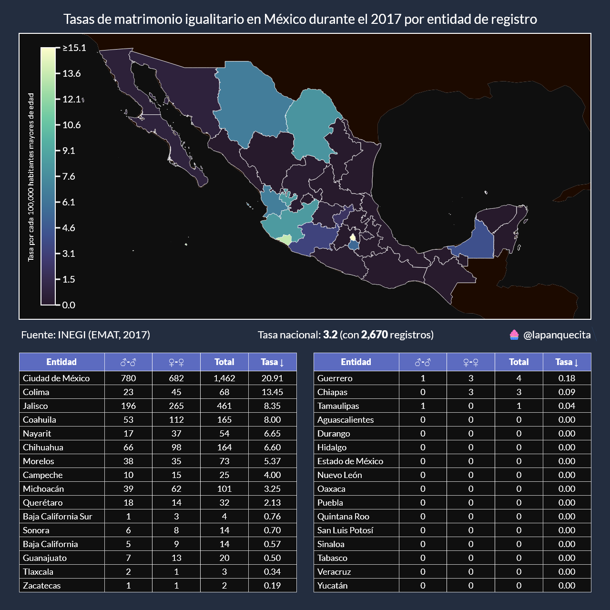
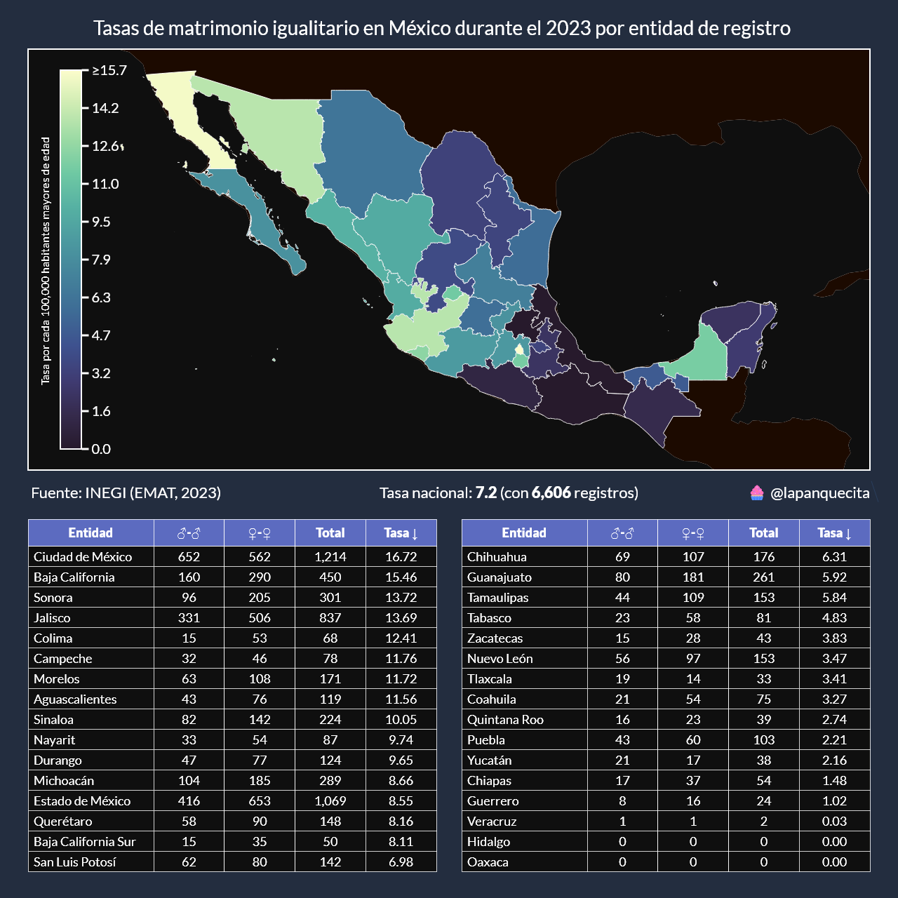

# Matrimonio igualitario en México

En este repositorio se encuentran funciones y datos para analizar y comparar el matrimonio igualitario en México.

Los datos utilizados en este proyecto fueron obtenidos de las Estadísticas de Matrimonios (EMAT) del Instituto Nacional de Estadística y Geografía (INEGI).

https://www.inegi.org.mx/programas/emat/#microdatos

Se descargaron los microdatos del período 2010-2023, se seleccionaron las variables de interés y se unieron en un solo archivo `data.csv`.

## Tendencias del matrimonio igualitario en México

Los primeros registros de matrimonio igualitario en México comienzan en el año 2010, desde ese año hasta el 2016 los matrimonios entre hombres eran más comunes que entre mujeres. Esta tendencia cambió en el 2017 y se ha mantenido desde entonces.

Se han registrado un total de 38,392 matrimonios igualitarios en México, de estos, 17,237 (44.9%) han sido entre hombres, y 21,155 (55.1%) han sido entre mujeres.

Algo importante de destacar es que los registros de matrimonios igualitarios han aumentado año tras año, con la excepción del año 2020, debido al confinamiento por la pandemia de COVID-19.

Sin embargo, este no es el caso en matrimonios entre parejas del sexo opuesto.

La tasa de matrimonios entre parejas del sexo opuesto se ha reducido en un 31% de 2010 a 2023. Se puede observar una ligera corrección en la tendencia después del confinamiento del 2020, aún así, la tendencia se mantiene a la baja.

## Edades de los contrayentes

Algo interesante que descubrí al analizar las edades de los contrayentes de matrimonio en México fue su tendencia a la alza para ambos sexos.

Es de notar que la edad de los hombres en matrimonios igualitarios presentó un ligero aumento desde su comienzo hasta la fecha más reciente.

También se puede observar como la brecha se está cerrando entre ambos tipos de matrimonio.

En el caso de las mujeres, la tendencia es parecida a lo de los hombres, con una clara diferencia de 8.6 años en el 2010.

## Entidades con más registros de matrimonio igualitario

El siguiente paso es conocer donde se realizan estos matrimonios. Para esto utilizaremos 3 años diferentes: el primero, un punto medio y el más reciente.

Como habíamos comentado al inicio del artículo, la Ciudad de México fue la primera entidad en legalizar el matrimonio igualitario y aquí lo podemos comprobar.

De las 1,378 personas que contrajeron matrimonio, 95.6% eran residentes de la Ciudad de México, 4% eran residentes del Estado de México.

Para el año 2017 el matrimonio igualitario se había legalizado en otras entidades, aunque ya no era exclusivo de la Ciudad de México, esta seguía liderando la lista.

De las 2,924 personas que se casaron en la Ciudad de México, solo 92.8% eran residentes. Las parejas del mismo sexo ya conocían sobre este nuevo derecho, pero les era muy complicado ejercerlo en sus entidades de residencia.

En 2023 solo dos entidades no tienen registros de matrimonio igualitario: Hidalgo y Oaxaca.

En el caso de Hidalgo, 18 de sus residentes contrajeron matrimonio igualitario, de estos, 16 lo hicieron en el Estado de México y los dos restantes en la Ciudad de México.

De las 2,428 personas que se casaron en la Ciudad de México, el 97.6% eran residentes de la misma y 2.1% del Estado de México.

Esto quiere decir que las personas ya no tienen la necesidad de viajar a la Ciudad de México para gozar de este derecho.

## Conclusión

Espero que hayan disfrutado de este artículo. En lo personal disfruté el descubrir la evolución de las tendencias, tanto en edades como en entidades.

Cada año iré actualizando este repositorio con los datos más recientes, así como con nuevos tipos de análisis.